# K230 Firmware Download and Flashing

## Table of Contents

- [About CanMV K230 Firmware](#about-canmv-k230-firmware)
- [Prepare the Devices](#prepare-the-devices)
- [Download the Firmware](#download-the-firmware)
- [Connect the K230 Device](#connect-the-k230-device)
- [Install the K230 Driver](#install-the-k230-driver)
- [Install the Flashing Tool](#install-the-flashing-tool)
- [Configure the Flashing Tool](#configure-the-flashing-tool)
- [Flash the Firmware](#flash-the-firmware)
- [Verify the Result](#verify-the-result)

## About CanMV K230 Firmware

1. **What is firmware?**

   You can think of it as the operating system of a phone or computer.

2. **When do you need to flash the firmware?**

   If the package you purchased does not include a TF card, you need to prepare a TF card larger than 4 GB, flash the firmware to it, and then insert the TF card into the TF card slot to use the K230 vision module. If your package already includes a TF card, the firmware has been pre-flashed at the factory and you can simply insert the card and use it.

3. **Can I flash third-party firmware?**

   Because the firmware contains pin definitions, peripheral drivers, and other configurations, flashing third-party K230 firmware is not recommended — it may lead to incompatibility issues.

## Prepare the Devices

You need a K230 vision module, a TF card larger than 4 GB, a Type-C data cable, and a Windows PC.

> **Note:** If the TF card contains data, back it up first — it may be wiped.

## Download the Firmware

Download the factory firmware from the K230 vision module resources. The file is named:

```
CanMV_K230_YAHBOOM_micropython_Vx.x.x.img.gz
```

where `Vx.x.x` is the version number.

After extracting the file, you will get the firmware image:

```
CanMV_K230_YAHBOOM_micropython_local_nncase_v2.9.0.img
```

## Connect the K230 Device

1. Make sure the TF card is removed from the K230 module's TF card slot.
2. Use a Type-C data cable to connect the K230 module to a USB port on the PC.

On the first connection, the Device Manager will show **K230 USB Boot Device** with a yellow exclamation mark — you need to install the driver first.

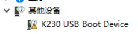

> **Note:** The K230 vision module draws a relatively large amount of power, so please connect it via a **USB 3.0** port.

## Install the K230 Driver

Download the driver tool `zadig-2.9.exe` from the K230 vision module resources.

Double-click the file, select **K230 USB Boot Device**, then click **Install Driver** to begin installation.

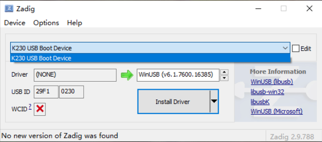

> **Note:** The driver only needs to be installed once.

After installation, unplug and reconnect the K230 vision module. The exclamation mark should disappear, indicating that the driver was installed successfully.


## Install the Flashing Tool

Download the flashing tool `K230BurningTool-Windows.zip` from the K230 vision module resources.

Extract the archive, locate `K230BurningTool.exe`, and double-click to open it.

> **Note:** The extraction path must NOT contain any Chinese (non-ASCII) characters.

## Configure the Flashing Tool

1. Click the **Open** button and select the firmware image you just extracted. Make sure the **image** checkbox is checked.

   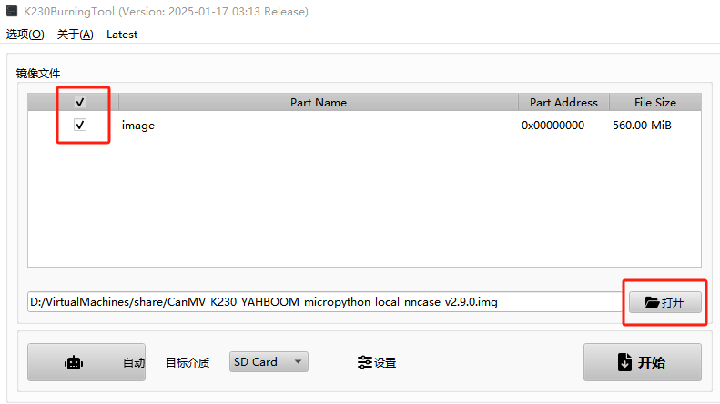

2. Set **Target Media** to **SD Card**.

   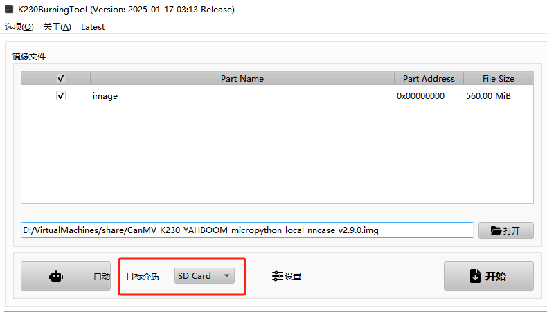

## Flash the Firmware

Insert the prepared TF card into the K230 vision module's TF card slot, then click the **Start** button to begin flashing.

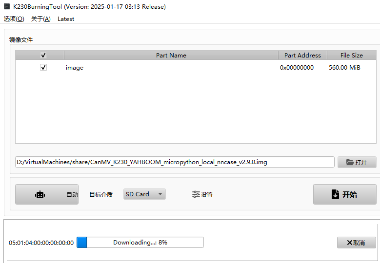

Wait until the progress bar reaches 100%, then click **Confirm** to complete the process.

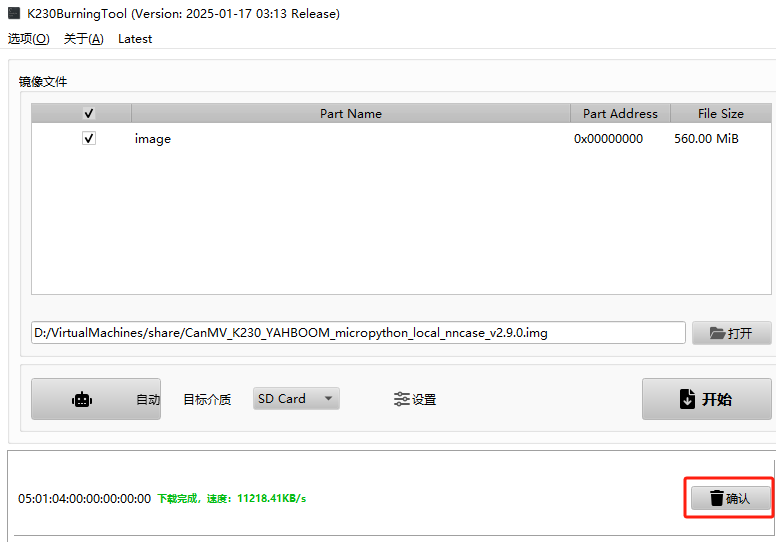

## Verify the Result

Unplug and re-plug the Type-C cable of the K230 vision module to power-cycle it.

> **Note:** After flashing, the first boot needs to initialize the TF card contents, so the system may report an "unrecognized USB device" error. Simply unplug and reconnect the Type-C cable.

Once reconnected, if **OpenMV Cam USB COM Port** (e.g. `COM23`) appears under **Ports (COM & LPT)** in Device Manager, the device is running successfully.

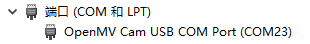

---

# Installing the Programming Environment

## Table of Contents

- [Errata](#errata-1)
- [Foreword — CanMV IDE K230](#foreword--canmv-ide-k230)
- [Install CanMV IDE on Windows](#install-canmv-ide-on-windows)
- [Other Notes](#other-notes)

## Errata

The K230 vision module ships with **CanMV IDE K230 V4.0.0 and later** by default. The older V3.0.0 IDE cannot be used — please download the latest version.

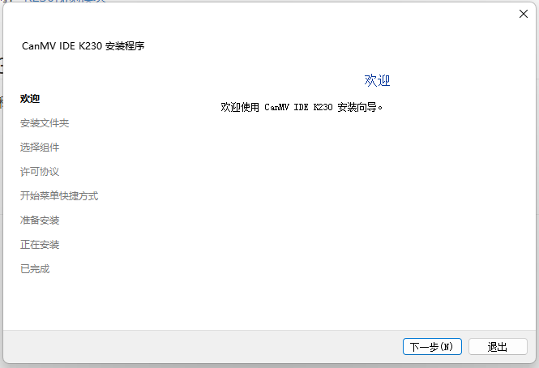

## Foreword — CanMV IDE K230

The CanMV IDE K230 software is a customized IDE developed based on the open-source project **openmv-idepy** (https://github.com/Boo-An/openmv-idepy). It is essentially a purpose-built code editor for **MicroPython** on the K230 chip, providing an all-in-one development environment for writing, debugging, and running MicroPython programs.

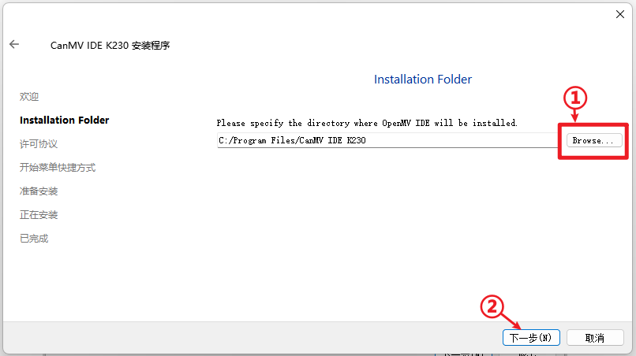

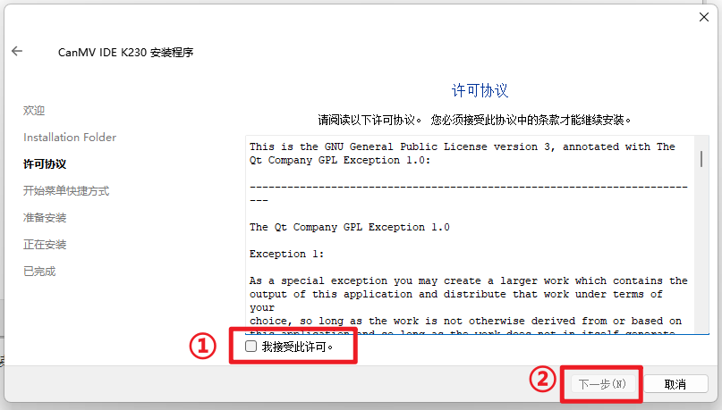

## Install CanMV IDE on Windows

### Step 1: Download CanMV IDE K230

Download the latest version — **CanMV IDE K230 V4.0.0** or later — from the K230 vision module resources.

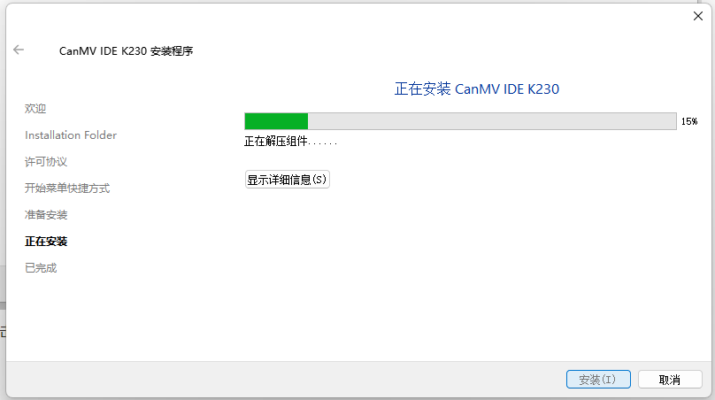

### Step 2: Run the Installer

Double-click the downloaded installer. Follow the on-screen prompts to proceed.

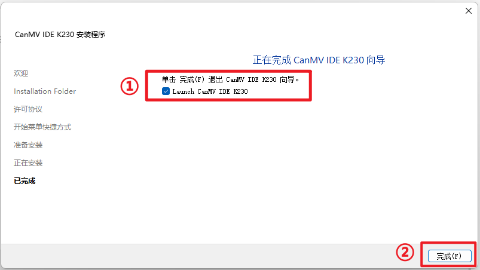

### Step 3: Complete Installation

Choose an installation directory, then click **Install** and wait for the installation to finish.

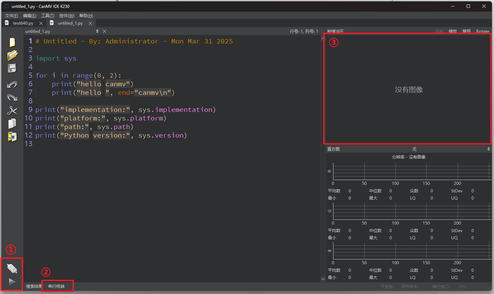

Once the installation is complete, click **Finish**. A shortcut for **CanMV IDE K230** will be created on your desktop.

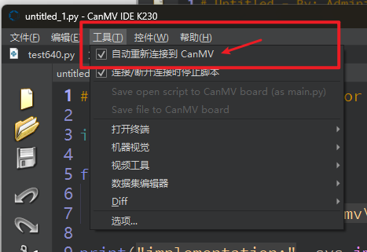

## Other Notes

- **Do not use Chinese (non-ASCII) characters** in the installation path — this may cause the IDE to fail to launch.
- After installation, you can connect the K230 vision module and start programming with MicroPython.
- Refer to the next section to learn how to run your first program.

---

# Debugging and Running Examples

## Table of Contents

- [Step 0: Open CanMV IDE K230](#step-0-open-canmv-ide-k230)
- [Step 1: Connect the K230 Device](#step-1-connect-the-k230-device)
- [Step 2: Open an Example Script](#step-2-open-an-example-script)
- [Step 3: Select the COM Port](#step-3-select-the-com-port)
- [Step 4: Connect and Run](#step-4-connect-and-run)
- [Debugging Features](#debugging-features)
- [Important Notes](#important-notes)

## Step 0: Open CanMV IDE K230

Double-click the **CanMV IDE K230** shortcut on your desktop to launch the IDE.


## Step 1: Connect the K230 Device

Use a Type-C data cable to connect the K230 vision module to a USB port on your PC.

If the driver has already been installed (see firmware flashing section), you can skip this step. Otherwise, refer to the driver installation steps earlier in this document.

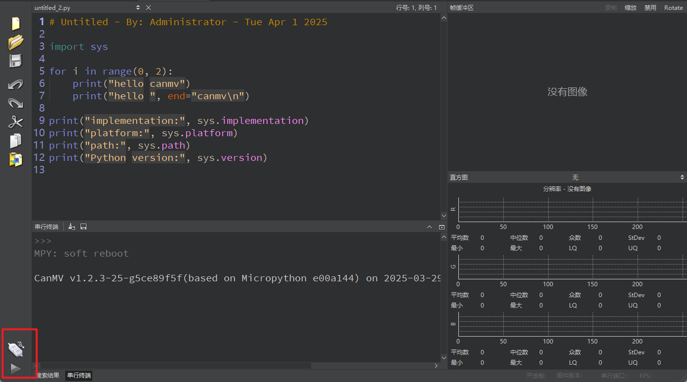

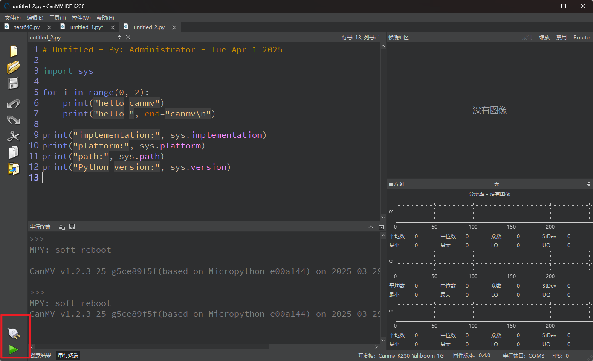

## Step 2: Open an Example Script

In the IDE, navigate the file browser on the left side to find and open an example MicroPython script (`.py` file) from the K230 example library.

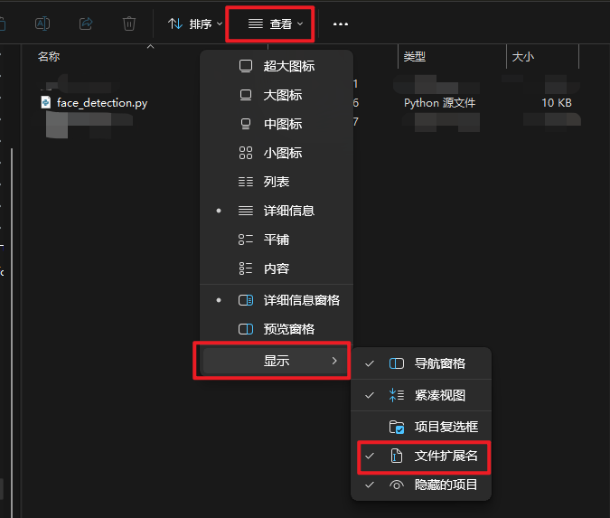

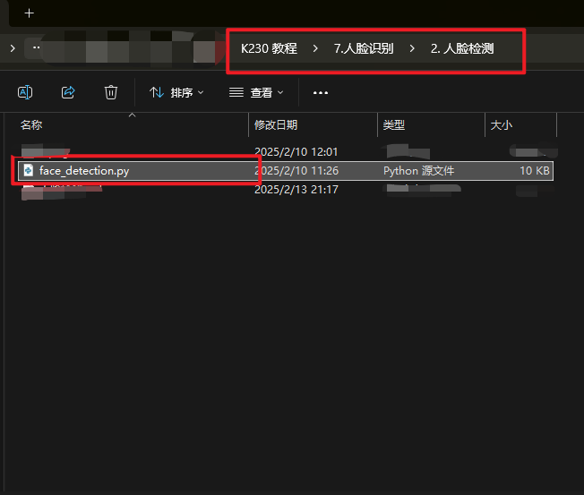

## Step 3: Select the COM Port

At the bottom-left corner of the IDE, click the **Connect** button area to open the port selection dropdown. Select the COM port that corresponds to **OpenMV Cam** (e.g., `COM23`).

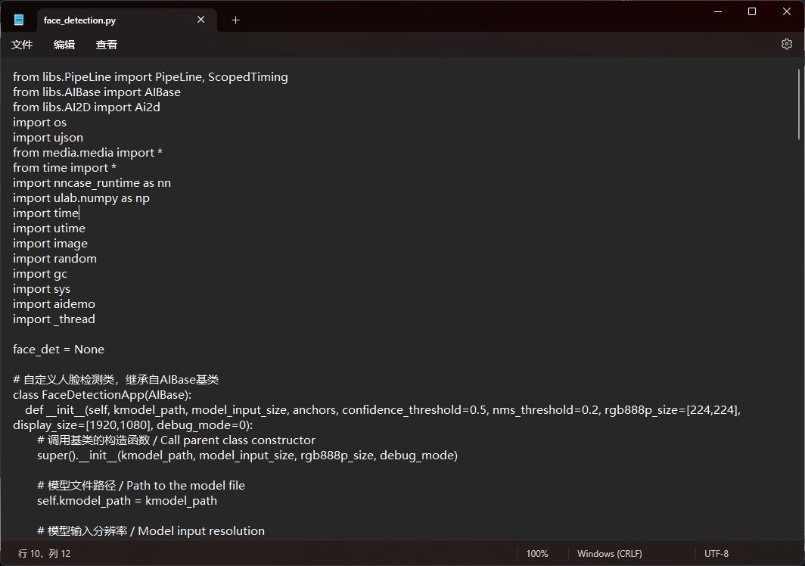

## Step 4: Connect and Run

After selecting the correct COM port, click the green **Connect** button (bottom-left) to establish the connection with the K230 device.

Once connected, click the green **Run** button (bottom-left) to execute the currently opened script on the K230.

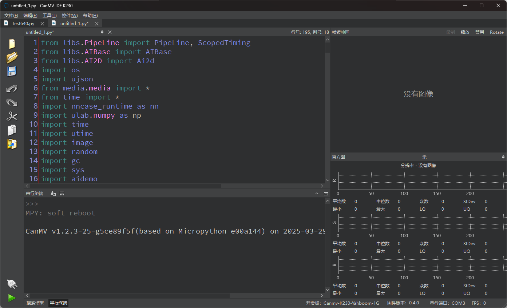

## Debugging Features

### Serial Terminal

The serial terminal at the bottom of the IDE displays `print()` output from your MicroPython script, allowing you to view logs and debug messages in real time.

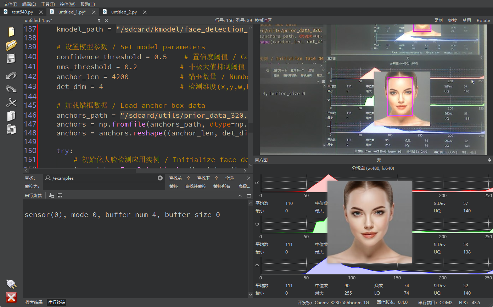

### Frame Buffer

The frame buffer window (top-right area) displays real-time camera frames when your script captures images from the K230's camera. This is useful for visual debugging of image processing code.

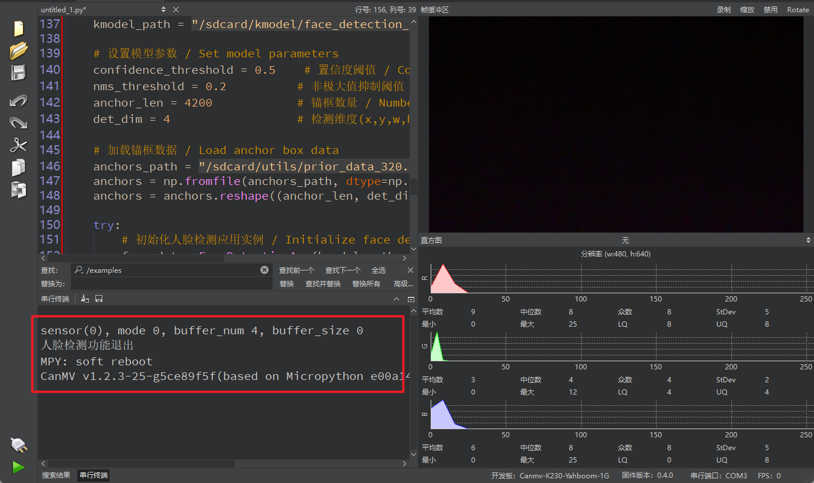

## Important Notes

- Make sure the K230 device is properly connected and the driver is installed before attempting to connect in the IDE.
- If the device does not appear in the COM port list, unplug and re-plug the Type-C cable, then click the refresh button.
- Always **stop** the running script (red stop button) before editing or uploading new code.
- Refer to the Serial Terminal output for error messages if your script fails to run.

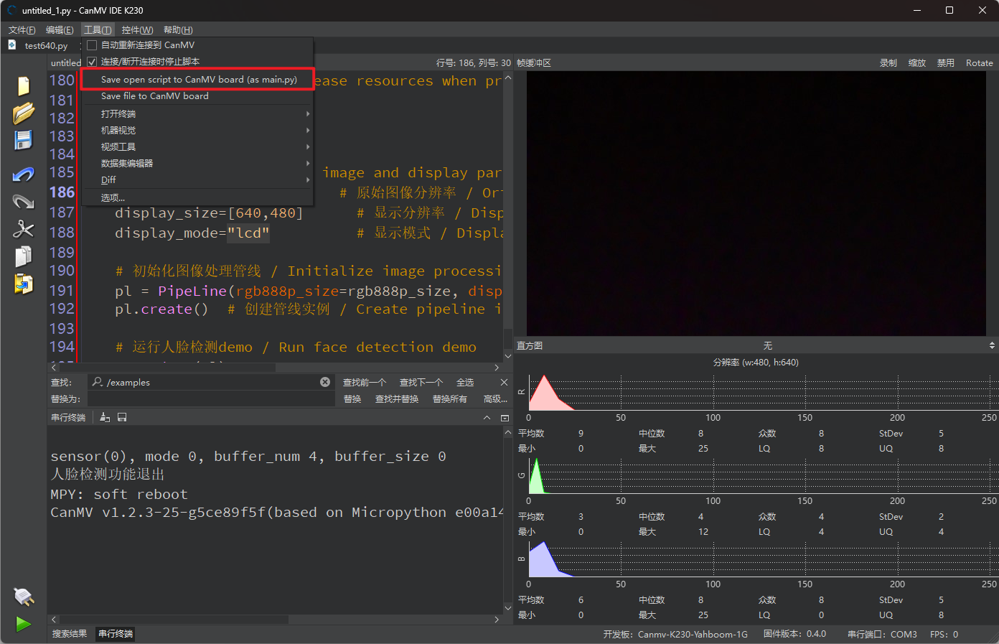
